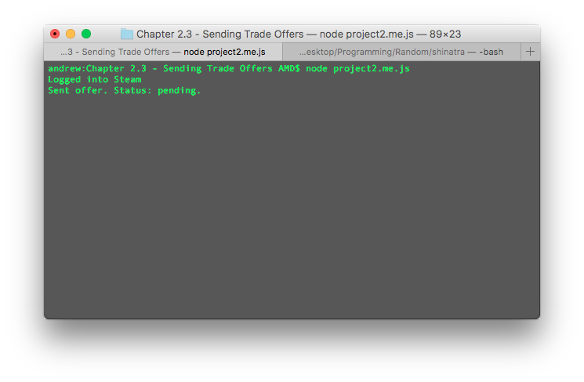
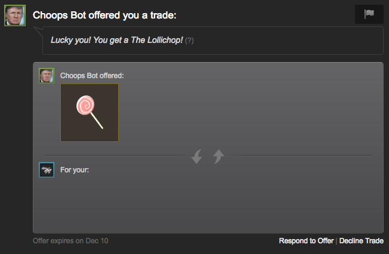
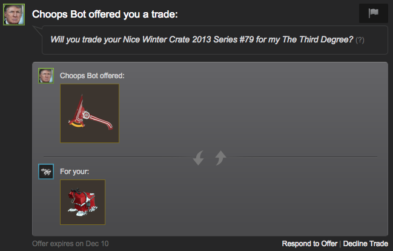

# Chapter 2.3 - Sending Trade Offers

<a target='_blank' rel='nofollow' href='https://app.codesponsor.io/link/WWKSZ8BufMHxCu7dPGG4np4x/andrewda/node-steam-guide'>
  
</a>

Now that we know how to handle incoming trade offers, sending them shouldn't
be too much more difficult. Let's add some more code to our `project2.js` so
that it sends a specific user a random item from our inventory.

How about we start off by fetching a random item. Think about how we might go
about this. First, we're going to load our inventory (which is loaded as an
array of items), then we'll choose a random number from 0 to the number of
items we have in our inventory. We'll use that number to fetch a specific item
from our inventory.

Let's start coding. First we'll create a new function.

```js
function sendRandomItem() {
  manager.loadInventory(440, 2, true, (err, inventory) => {
    if (err) {
      console.log(err);
    } else {
      const offer = manager.createOffer('partner_steam_id');
      const item = inventory[Math.floor(Math.random() * inventory.length - 1)];

      offer.addMyItem(item);
      offer.setMessage(`Lucky you! You get a ${item.name}!`);
      offer.send((err, status) => {
        if (err) {
          console.log(err);
        } else {
          console.log(`Sent offer. Status: ${status}.`);
        }
      });
    }
  });
}
```

Whoa, okay, that was quite a bit of code. Let's go through what it does. When
this function is executed, it first loads our TF2 inventory (appid `440` – if
you want to send a random CS:GO item change this to `730`), which has a
contextid of `2`. The next parameter we pass is whether we should only load
tradable items – we say `true`. We then create a new offer using `manager`'s
`.createOffer()` method. This method takes a Steam ID, so make sure you set it
to another account which you want to send an item to. Then we choose a random
item in our inventory and set it to the `item` variable. We add this item to
the offer using its `.addMyItem()` method, and we set the message using
`.setMessage()`. Then, after all that, we send the trade using `.send()`.

We just need to add a little bit more code for our bot to work. We'll need to
edit the `webSession` event listener.

```js
client.on('webSession', (sessionid, cookies) => {
	[...]

	sendRandomItem();
});
```

This is pretty simple, it just executes the function we created above. Now,
let's run the bot using `node project2.js`. Hopefully, you should see "Sent
offer. Status: sent/pending." message appear in the command line.



You should also get a trade offer containing the random item within about 10 to
30 seconds.



Let's add one more little feature to the bot – we should ask for one of their
items in exchange for our's. At this point in time, we won't bother checking if
it's a good deal or not, but we'll get into that later in a future chapter.

Let's change up our code from the `sendRandomItem()` function a bit. This code
will look pretty ugly, but we'll worry about making it more pretty in the
future – this is a proof-of-concept.

```js
function sendRandomItem() {
  const partner = 'partner_steam_id';
  const appid = 440;
  const contextid = 2;

  const offer = manager.createOffer(partner);

  manager.loadInventory(appid, contextid, true, (err, myInv) => {
    if (err) {
      console.log(err);
    } else {
      const myItem = myInv[Math.floor(Math.random() * myInv.length - 1)];
      offer.addMyItem(myItem);

      manager.loadUserInventory(
        partner,
        appid,
        contextid,
        true,
        (err, theirInv) => {
          if (err) {
            console.log(err);
          } else {
            const theirItem =
              theirInv[Math.floor(Math.random() * theirInv.length - 1)];
            offer.addTheirItem(theirItem);

            offer.setMessage(
              `Will you trade your ${theirItem.name} for my ${myItem.name}?`
            );
            offer.send((err, status) => {
              if (err) {
                console.log(err);
              } else {
                console.log(`Sent offer. Status: ${status}.`);
              }
            });
          }
        }
      );
    }
  });
}
```

Alright so we changed this code up quite a bit. In short, we are now loading
their inventory as well and adding their item to the trade using the
`.addTheirItem()` method.

Try running this code now and see what happens. It should create a trade
looking something like this:



Nice. Obviously this will result in some pretty crazy trade offers, but again,
we'll get into price checking in a future chapter.

[Continue Reading](../Chapter%202.4%20-%20Accepting%20Donations)
