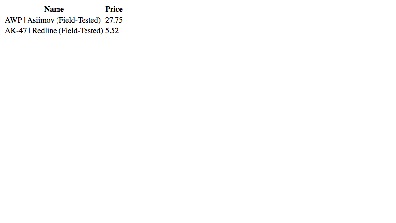

# Chapter 4.4 - Databases

Now we know how to send data to a template. That's great and all, but our site
is still completely static. Nothing will ever change unless we mess with the
code. Obviously, it would be very impractical for us to have to change the code
every time something needs to be changes on our site – that should all be
automated! But how do we go about automating something like this? That's what
we'll be taking a look at in this section.

Let's create a new file and call it something like `project6.js`:

```js
const mongoose = require('mongoose');

mongoose.connect('mongodb://127.0.0.1:27017/guide');

const Item = mongoose.model('Item', mongoose.Schema({
    name: String,
	price: Number
}));

const awpAsiimov = new Item({
	name: 'AWP | Asiimov (Field-Tested)',
	price: 27.75
});


const akRedline = new Item({
	name: 'AK-47 | Redline (Field-Tested)',
	price: 5.52
});

awpAsiimov.save((err, item) => {
	if (err) {
		console.log(err);
	} else {
		console.log(item);
	}
});

akRedline.save((err, item) => {
	if (err) {
		console.log(err);
	} else {
		console.log(item);
	}
});
```

In this block of code, we're saving two documents (the MongoDB equivalent of a
MySQL "row") which are saved in the `Items` collection (or "table" for those
familiar with MySQL). We define what a document within the collection should
look like by creating the `Item` model. Then we form two new Item documents by
initializing `new Item`'s and passing in the required properties (in this case
a `name`, which we define as a string, and a `price`, which we define as a
number).

Before running this code, make sure you've started MongoDB using the `mongod`
command or starting the service. After running this code, you should see
something like this appear in the console:

```text
{ __v: 0,
  name: 'AWP | Asiimov (Field-Tested)',
  price: 27.75,
  _id: 585a28433124bcb7d5fd59d3 }
{ __v: 0,
  name: 'AK-47 | Redline (Field-Tested)',
  price: 5.52,
  _id: 92d1a68bb132bba3943a62e4 }
```

Fantastic! You've saved your first documents to a MongoDB collection. Now we'll
implement it into the code we had in Chapter 4.3. Make a new directory called
`project7` and copy the contents of Chapter 4.3's code into it. We'll be
working with the `app.js` code:

```js
// app.js

const express = require('express');
const handlebars = require('express-handlebars');
const path = require('path');
const mongoose = require('mongoose');

const app = express();
const hbs = handlebars.create();

mongoose.connect('mongodb://127.0.0.1:27017/guide');

const Item = mongoose.model('Item', mongoose.Schema({
    name: String,
	price: Number
}));

[...]

app.get('/', (req, res) => {
	Item.find({}, (err, items) => {
		if (err) {
			console.log(err);
		}

		res.render('main', { items });
	});
});

app.listen(3037);
```

Here, we connected to our MongoDB server and created a new Item model. Then,
when we get a request to `/`, we find all item documents in the Item
collection and pass them on to the `main.hbs` template.

Now we need to change the `main.hbs` template in order to process the incoming
items data.

```html
<!-- main.hbs -->

<!DOCTYPE html>
<html>
	<head>
		<title>Item List</title>
	</head>
	<body>
		<table>
			<tr>
				<th>Name</th>
				<th>Price</th>
			</tr>
			{{#each items}}
			<tr>
				<td>{{this.name}}</td>
				<td>{{this.price}}</td>
			</tr>
			{{/each}}
		</table>
	</body>
</html>
```

Here we're using the Handlebars `#each` operator, which is similar to a
JavaScript `forEach` loop. To access each item in the loop, we use `this.prop`.
By using `{{this.name}}`, we're accessing the `name` property of each item. At
the beginning of this section, we saved a couple documents to our MongoDB
database. Now, if we run this code, a table displaying all the item names and
prices will appear. Let's give it a go. Run the `app.js` file and navigate to
`http://127.0.0.1:3037`. You should see something like this:



Looks good! We now know how to access and use databases within our website.
We'll be looking into using databases within our bots in a future chapter, but
it's almost exactly the same.

Although this is working well, it's still not very clean to define our models
within the `app.js` file. Let's extract the model we're defining in here into a
`models/item.js` file. Create that file now and add the following code:

```js
// models/item.js

const mongoose = require('mongoose');

module.exports = mongoose.model('Item', {
    name: String,
	price: Number
});
```

Now we can remove the model from `app.js` and require our new model file at the
top of `app.js`:

```js
// app.js

[...]

const Item = require('./models/item');

[...]
```

[Continue Reading](../Chapter 4.5 - WebSockets)
