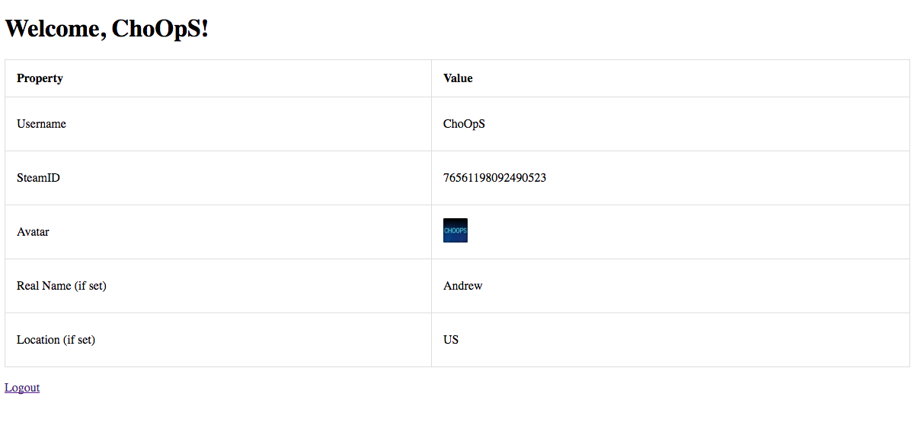

# Chapter 5.2 - Authentication

<a target='_blank' rel='nofollow' href='https://app.codesponsor.io/link/WWKSZ8BufMHxCu7dPGG4np4x/andrewda/node-steam-guide'>
  
</a>

Well, now you should have the basics of web development down, so let's get into
some more advanced topics. In this chapter, we're going to be focusing on
authentication using Steam's API. The Steam API uses OpenID 2.0, so it might be
nice to take a look at how that works, though it's not necessary. Basically, we
send the user to a specific URL, they click "Login" on Steam, and finally they
are sent back to our server with their information. You'll need to get your
Steam API key for this section, which you can get from the developer page at
http://steamcommunity.com/dev/apikey.

Let's jump right into it. We're going to copy `project5` again from 
[Chapter 4.3](../../Chapter%204%20-%20Basics%20of%20Web%20Development/Chapter%204.3%20-%20Templates)
and name the new folder `project9`. We'll start off by modifying the `app.js`:

```js
// app.js

const express = require('express');
const handlebars = require('express-handlebars');
const session = require('express-session');
const passport = require('passport');
const SteamStrategy = require('passport-steam').Strategy;
const path = require('path');

const app = express();
const hbs = handlebars.create();

passport.serializeUser((user, done) => {
  done(null, user._json);
});

passport.deserializeUser((obj, done) => {
  done(null, obj);
});

passport.use(
  new SteamStrategy(
    {
      returnURL: 'http://localhost:3037/auth/steam/return',
      realm: 'http://localhost:3037/',
      apiKey: 'your api key'
    },
    (identifier, profile, done) => {
      return done(null, profile);
    }
  )
);

app.engine('hbs', hbs.engine);
app.set('views', path.join(__dirname, 'views'));
app.set('view engine', 'hbs');

app.use(
  session({
    secret: 'some secret string',
    name: 'U_SESSION',
    resave: true,
    saveUninitialized: true
  })
);

app.use(passport.initialize());
app.use(passport.session());

app.get('/', (req, res) => {
  res.render('main', {
    user: req.user
  });
});

app.get(
  /^\/auth\/steam(\/return)?$/,
  passport.authenticate('steam', { failureRedirect: '/' }),
  (req, res) => {
    res.redirect('/');
  }
);

app.get('/logout', (req, res) => {
  req.logout();
  res.redirect('/');
});

app.listen(3037);
```

Alright, that was a ton of code. We'll walk through it line-by-line.

First of all, we imported our new modules: `express-session`, `passport`, and
`passport-steam`. Each of these modules has to do with authentication:
Passport is the base authentication module, which passport-steam adds onto. The
passport-steam module takes the user data from Steam and gives us this data. We
save the data in a "session" using express-session. A "session" is a long hash
used by the client which references an object – in our case the user's
information.

The next lines – `serializeUser` and `deserializeUser` – are used by Passport
to save and access the data passed to it by passport-steam. When we start to
create our actual application, we'll reference the database in `serializeUser`
to get, for example, the number of credits the user has.

Then we get to our `passport.use` line. Here we're telling Passport to use
our `SteamStrategy` (aka passport-steam) and we pass it a bunch of parameters.
First, we have `returnURL`, which is the URL that we should be sent to after
clicking "Login" on Steam. Then we have `realm`, which is our website's URL.
Finally we have our `apiKey` which should be pretty obvious – it's our Steam
API key we got earlier in this section. When we successfully receive a login
from Steam, we then pass it on by saying `done(null, profile)` – `null` meaning
no error occurred.

We also have our Express app use `session`. This allows us to save sessions to
the client. We pass it a `secret`, `name`, `resave`, and `saveUninitialized`.
Your `secret` should be a string that only you know, and `name` should be what
you want the session/cookie name to be.

We then added something that looks a bit similar but yet a bit confusing at the
same time. We setup an Express route using `app.get`, but instead of passing in
a route, we pass in regex: `/^\/auth\/steam(\/return)?$/`. This regex matches
`/auth/steam` as well as `/auth/steam/return`. When either one of these is
accessed, we tell Passport to try to authenticate us using Steam. If we're
returning from Steam, Passport will pass us on and we'll get redirected to the
`/` route due to our `res.redirect('/');` code.

Finally, we added a way to logout. When the user navigates or is sent to
`/logout`, their session is destroyed and they are sent to the main page again.

Great! Hopefully you understand all this code (if you don't, feel free to
create a GitHub issue or contact me). Now it's time to look at the front-end
code that goes along with it. We're going to display all the user's information
do demonstrate what we get back from Steam. Note that I added a bit of CSS to
this code to make it look semi-nice, but I won't be explaining it because this
guide is focussed on Steam and Node.js – not HTML and CSS.

```html
<!-- main.hbs -->

<!DOCTYPE html>
<html>
	<head>
		<title>Steam Login</title>
		<style>
		table, td, th {
			border: 1px solid #ddd;
			text-align: left;
		}
		table {
			border-collapse: collapse;
			width: 100%;
		}
		th, td {
			padding: 15px;
		}
		td {
			height: 40px;
		}
		</style>
	</head>
	<body>
		{{#if user}}
		<h1>Welcome, {{user.personaname}}!</h1>
		<table>
			<tr>
				<th>Property</th>
				<th>Value</th>
			</tr>
			<tr>
				<td>Username</td>
				<td>{{user.personaname}}</td>
			</tr>
			<tr>
				<td>SteamID</td>
				<td>{{user.steamid}}</td>
			</tr>
			<tr>
				<td>Avatar</td>
				<td></td>
			</tr>
			<tr>
				<td>Real Name (if set)</td>
				<td>{{user.realname}}</td>
			</tr>
			<tr>
				<td>Location (if set)</td>
				<td>{{user.loccountrycode}}</td>
			</tr>
		</table>
		<br />
		<a href="/logout">Logout</a>
		{{else}}
		<a href="/auth/steam">Click here to login</a>
		{{/if}}
	</body>
</html>
```

Here, we make use of the Handlebars `#if` statement. If the `user` variable
exists (i.e. the user is logged in), we display the user's information by using
`{{user.property}}`. If the `user` variable does not exist or is undefined, we
show the user a link to login. After logging in, the user should see their
information on the screen which should look something like this:


